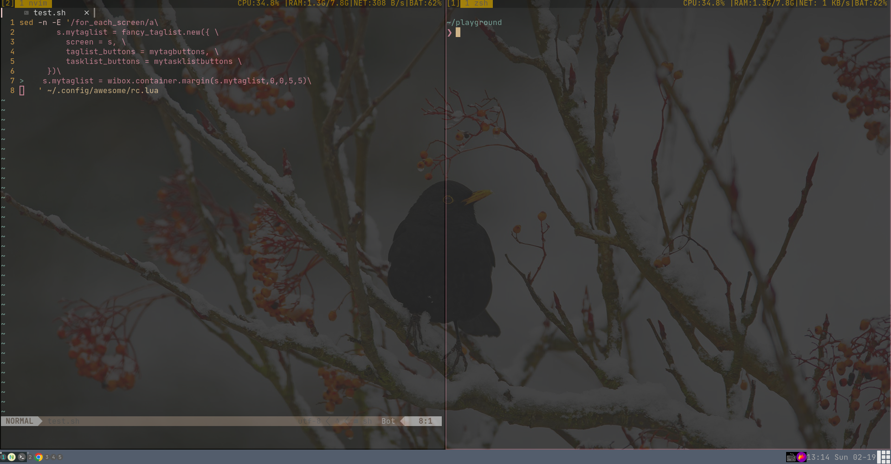

# self devbox
## picture

## os
* kitty installer
```
curl -L https://sw.kovidgoyal.net/kitty/installer.sh | sh /dev/stdin
```
* kitty.desktop
```
[Desktop Entry]
Name=Kitty
Comment=Code Editing. Redefined.
GenericName=Text Editor
Exec=/opt/soft/kitty/bin/kitty
Icon=/opt/soft/kitty/share/icons/hicolor/256x256/apps/kitty.png
Type=Application
StartupNotify=false
StartupWMClass=Kitty
Categories=TextEditor;Development;IDE;
MimeType=text/plain;inode/directory;application/x-code-workspace;
Actions=new-empty-window;
Keywords=kitty;
```
## Ranger
S Open a shell in the current directory;
and type exit in terminal to go back to rangerl
```
git clone https://github.com/alexanderjeurissen/ranger_devicons ~/.config/ranger/plugins/ranger_devicons
echo "default_linemode devicons" >> $HOME/.config/ranger/rc.conf
```

https://github.com/gotbletu/shownotes/blob/master/ranger_file_locate_fzf.md

```
vim ~/.config/ranger/commands.py

# https://github.com/ranger/ranger/wiki/Integrating-File-Search-with-fzf
# Now, simply bind this function to a key, by adding this to your ~/.config/ranger/rc.conf: map <C-f> fzf_select
class fzf_select(Command):
    """
    :fzf_select

    Find a file using fzf.

    With a prefix argument select only directories.

    See: https://github.com/junegunn/fzf
    """
    def execute(self):
        import subprocess
        if self.quantifier:
            # match only directories
            command="find -L . \( -path '*/\.*' -o -fstype 'dev' -o -fstype 'proc' \) -prune \
            -o -type d -print 2> /dev/null | sed 1d | cut -b3- | fzf +m"
        else:
            # match files and directories
            command="find -L . \( -path '*/\.*' -o -fstype 'dev' -o -fstype 'proc' \) -prune \
            -o -print 2> /dev/null | sed 1d | cut -b3- | fzf +m"
        fzf = self.fm.execute_command(command, stdout=subprocess.PIPE)
        stdout, stderr = fzf.communicate()
        if fzf.returncode == 0:
            fzf_file = os.path.abspath(stdout.decode('utf-8').rstrip('\n'))
            if os.path.isdir(fzf_file):
                self.fm.cd(fzf_file)
            else:
                self.fm.select_file(fzf_file)
# fzf_locate
class fzf_locate(Command):
    """
    :fzf_locate

    Find a file using fzf.

    With a prefix argument select only directories.

    See: https://github.com/junegunn/fzf
    """
    def execute(self):
        import subprocessvim ~/.config/ranger/rc.conf

        if self.quantifier:
            command="locate home media | fzf -e -i"
        else:
            command="locate home media | fzf -e -i"
        fzf = self.fm.execute_command(command, stdout=subprocess.PIPE)
        stdout, stderr = fzf.communicate()
        if fzf.returncode == 0:
            fzf_file = os.path.abspath(stdout.decode('utf-8').rstrip('\n'))
            if os.path.isdir(fzf_file):
                self.fm.cd(fzf_file)
            else:
                self.fm.select_file(fzf_file)


```

```
vim ~/.config/ranger/rc.conf

map <C-f> fzf_select
map <C-g> fzf_locate
```

```
git clone https://github.com/wting/autojump.git 
cd autojump
./install.py or ./uninstall.py
```


```
cd ~/.config/ranger/plugins
wget https://raw.githubusercontent.com/fdw/ranger-autojump/main/autojump.py
map cj console j%space

```


## neovim
###  vim help
```
vim +"help lua | only"
```
###  writing
| plugin                       | commands or maps | desc                               |
|------------------------------|------------------|------------------------------------|
| dhruvasagar/vim-table-mode   | TableModeToggle  | insert using \|,second line two \| |
| zhoupro/md-image-paste       | PasteImg         | insert img from host to md img     |
| iamcco/markdown-preview.nvim | MarkdownPreview  | priview current md file            |

### coding
| plugin                   | commands or maps    | desc                     |
|--------------------------|---------------------|--------------------------|
| godlygeek/tabular        | Tabularize /=       | = is sep symbol          |
| zhoupro/leetcode.vim     | LeetCodeList        | leet ide                 |
| RishabhRD/nvim-cheat.sh  | Cheat               |                          |
| wellle/targets.vim       | t                   | text object              |
| tpope/vim-abolish        | m c s u - . t space |                          |
| tpope/vim-surround       | ds cs yss           |                          |
| tpope/vim-commentary     | gcc                 | comment                  |
| ThePrimeagen/harpoon     | tt  ta              | file mark                |
| akinsho/toggleterm.nvim  | ctrl_t              | terminal                 |
| kevinhwang91/nvim-ufo    | zr zm               | fold                     |
| AndrewRadev/tagalong.vim |                     | change tag               |
| mattn/emmet-vim          |                     | emmet                    |
| jiangmiao/auto-pairs     |                     | brackets, parens, quotes |
| zhoupro/vim-dadbod       |                     | database                 |
| tpope/vim-repeat         |                     |                          |
| rlue/vim-barbaric        |                     |                          |
| linty-org/key-menu.nvim  |                     |                          |
| trmckay/based.nvim       | c-b                 | hex-dec  view            |
| AckslD/messages.nvim     |                     | Messages message         |


### fold buf view
| plugin                      | desc                                             | commands     |
|-----------------------------|--------------------------------------------------|--------------|
| romgrk/barbar.nvim          |                                                  |              |
| phaazon/hop.nvim            |                                                  |              |
| majutsushi/tagbar           |                                                  |              |
| nvim-lualine/lualine.nvim   |                                                  |              |
| folke/trouble.nvim          | Trouble                                          | err nav      |
| kyazdani42/nvim-tree.lua    | NvimTreeToggle:,-n copy:c,paste:p, clear find:F, | file exploer |
| MattesGroeger/vim-bookmarks |                                                  |              |
| junegunn/fzf                |                                                  |              |
| junegunn/fzf.vim            |                                                  |              |


### git
| plugin                 | desc                                              | commands         |
|------------------------|---------------------------------------------------|------------------|
| tpope/vim-fugitive     | Gblame, Git log -- file: to find any version file | git              |
| airblade/vim-gitgutter |                                                   | sign             |
| sindrets/diffview.nvim | DiffviewOpen HEAD~2 -- lua/diffview               | view branch file |

### lsp and dap

| plugin                                    | desc      | commands |
|-------------------------------------------|-----------|----------|
| williamboman/mason.nvim                   | installer |          |
| williamboman/mason-lspconfig.nvim         | installer |          |
| neovim/nvim-lspconfig                     |           |          |
| hrsh7th/nvim-cmp                          |           |          |
| hrsh7th/cmp-nvim-lsp                      |           |          |
| hrsh7th/cmp-vsnip                         |           |          |
| hrsh7th/vim-vsnip                         |           |          |
| hrsh7th/cmp-path                          |           |          |
| hrsh7th/cmp-buffer                        |           |          |
| rafamadriz/friendly-snippets              |           |          |
| ray-x/lsp_signature.nvim                  |           |          |
| jbyuki/one-small-step-for-vimkind         |           |          |
| mfussenegger/nvim-dap                     |           |          |
| zhoupro/lsp_calltree                      |           |          |
| puremourning/vimspector                   |           |          |
| WhoIsSethDaniel/lualine-lsp-progress.nvim |           |          |


### libray
| plugin                 | desc        |
|------------------------|-------------|
| MunifTanjim/nui.nvim   | tree,input  |
| nvim-lua/plenary.nvim  | common code |
| aklt/plantuml-syntax   | plantuml    |
| preservim/vim-markdown | markdown    |
| morhetz/gruvbox        | theme       |
| RishabhRD/popfix       |             |
| voldikss/vim-floaterm  |             |


### language 
| plugin       | desc |
|--------------|------|
| fatih/vim-go |      |


### tricks


create:a,delete:d,cut:x,rename:r,find:f,up:-,down:C-]

## ubuntu & vagrant
docs/vagrant_ubuntu.md


## go
docs/go.md

## c
docs/c.md

## fe
docs/fe.md


## other

```sh
docker run -d -p 8080:8080 plantuml/plantuml-server:tomcat
```
